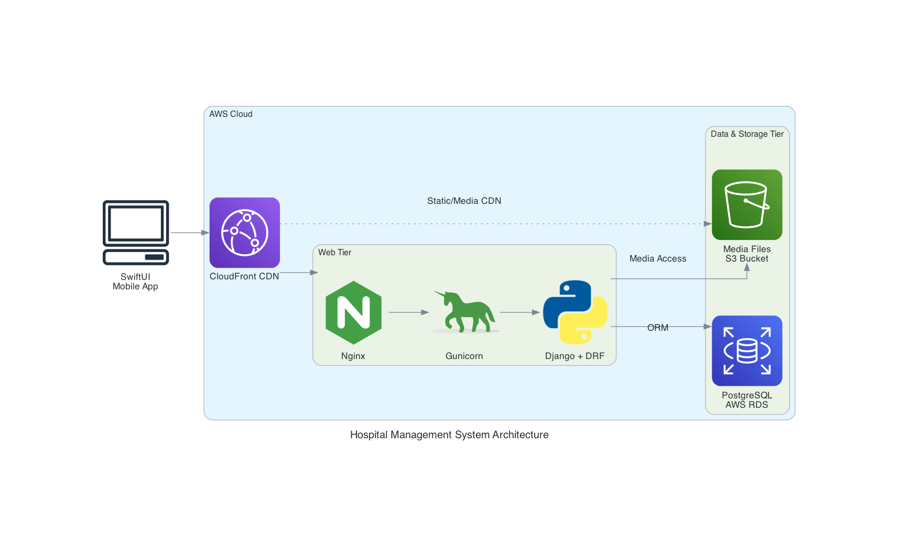

# Infosys Hospital Management System

An integrated platform for modern hospital operations, featuring a robust Django REST backend and a native iOS application. The system streamlines patient care, staff management, lab operations, billing, analytics, and document processing with AI-powered OCR.

---

## 🏗️ System Architecture



**Components:**

- **Backend:** Django + Django REST API (deployed on AWS EC2, Gunicorn, Nginx, PostgreSQL)
- **Frontend:** iOS SwiftUI app (MVVM, SwiftData, RESTful API)
- **Media/Static:** AWS S3
- **AI OCR:** Gemini-powered document extraction

---

## 📁 Project Structure

```
Backend/      # Django REST API, OCR, ML analytics, all hospital logic
FrontEnd/     # iOS SwiftUI app for patients, doctors, staff, admin
POC/          # Prototypes, test scripts, data schemas
Tests/        # Test cases and test data
hospital_management_architecture  # Graphviz/DOT architecture diagram
*.png         # Architecture images
```

---

## 🚀 Features

### Backend (Django REST API)

- **Authentication:** OTP, 2FA, JWT, role-based access
- **Patient/Staff/Admin Management:** CRUD, profiles, scheduling
- **Appointments:** Booking, rescheduling, history, doctor slots
- **Lab Management:** Test types, charges, results, workflow
- **Billing & Invoices:** Automated, downloadable PDFs, payment integration
- **Analytics:** Revenue, ratings, appointments, doctor specialization
- **AI OCR:** Upload, process, and extract medical data from documents (see `Backend/OCR_API_Documentation.md`)

### Frontend (iOS App)

- **Patient Portal:** Appointments, records, lab results, feedback
- **Doctor Dashboard:** Manage appointments, prescribe, update records
- **Admin Panel:** User/staff management, billing, analytics, shift slots
- **Lab Tech:** Upload/validate reports, manage schedules
- **Modern UI:** MVVM, SwiftData, accessibility, fast and secure

---

## 📚 Documentation

- **Backend API:** [`Backend/README.md`](Backend/README.md)
- **OCR API:** [`Backend/OCR_API_Documentation.md`](Backend/OCR_API_Documentation.md)
- **iOS App:** [`FrontEnd/README.md`](FrontEnd/README.md)
- **Tests:** [`Tests/README.md`](Tests/README.md)
- **POC:** [`POC/README.md`](POC/README.md)

---

## 🏁 Quick Start

### Backend

1. Install Python dependencies: `pip install -r Backend/requirements.txt`
2. Configure environment variables (see OCR docs for Gemini API)
3. Run migrations: `python manage.py migrate`
4. Start server: `python manage.py runserver`

### iOS App

1. Open `FrontEnd/Hospitality 2/Hospitality.xcodeproj` in Xcode
2. Build and run on simulator or device

---

## 🤖 AI & OCR

- Upload and process medical documents via `/api/hospital/ocr/` endpoints
- Extracts allergies, history, vitals, findings, and more (see OCR API doc)

---

## 📞 Contact & Contributions

For issues, suggestions, or contributions, please open an issue or pull request on this repository.
